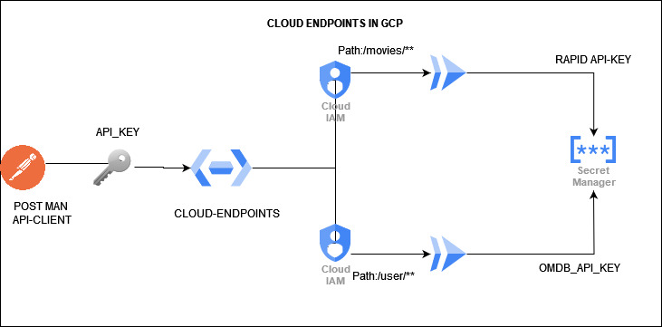

# cloud-endpoints-cloudrun-gcp
SIMPLE WEBSITE DEMONSTRATES API DEVELOPMENT IN CLOUD ENDPOINTS AND  BACKENDS HOSTED IN CLOUD RUN ALSO APIKEY AUTHENTICATION PROVIDED AND QUOTA REQUESTS  ALSO IMPLEMENTED
## TOOLS USED:
- CLOUD ENDPOINTS
- CLOUD RUN
- SECRET MANAGER
- OMDB API
- RAPID API
## ARCHITECTURE DIAGRAM

## STEPS TO DEPLOY
FIRST CLONE THIS REPO TO YOUR WORKSTATION
```bash
git clone https://github.com/Gkemhcs/cloud-endpoints-cloudrun-gcp.git
cd cloud-endpoints-cloudrun-gcp
``` 
THEN RUN DEPLOY SCRIPT
```bash
chmod +x deploy.sh
./deploy.sh
```
